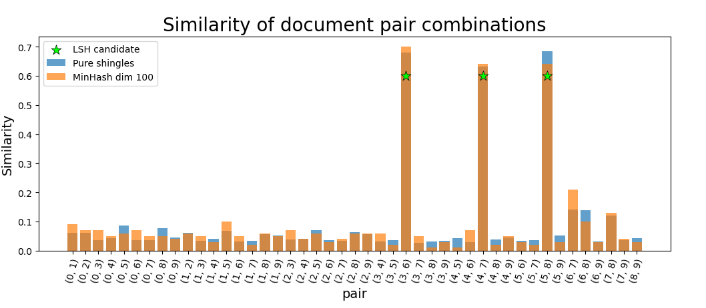
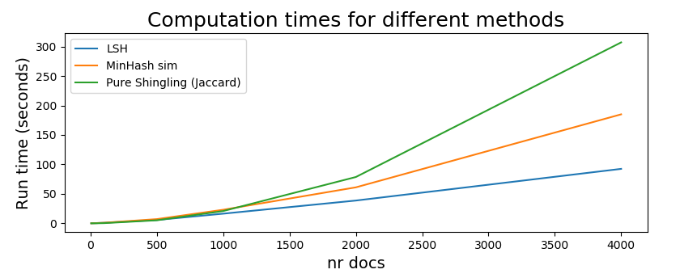

# Locality-Sensitive-Hashing
Implementation of Locality Sensitive Hashing (LSH) for similarity comparison in large data sets.

This code was implemented and by [@jos3f](https://github.com/hkindbom/ID2222-Data-Mining) and  [@hkindbom](https://github.com/hkindbom). 

The implementation furthermore contains document comparison using Jaccard similarity of the shingle sets, and signature similarity comparison which is an approximation of the former measure of similarity. The [Evaluation class](https://github.com/Jos3f/Locality-Sensitive-Hashing/blob/main/Evaluation.py) contains a comparison of the three stated approaches for this task with respect to accuracy and time complexity. 

### How to run

Tested with Python 3.6 and 3.8. 

Requirements: See requirements.txt in zip file. Can be installed with pip: `pip install -r requirements.txt`

Run: `python main.py`. Use the flag -h for help: `python main.py -h`.  

Two sample data sets are located in the Data directory, one of which contains pairs of very similar documents, which are more or less identified using the different methods.

### Evaluation

In this section, we evaluate: 
* The similarity between documents in a pair depending on the method used.
* The precision of the approximated similarity with respect to signate length.
* Computation time with respect to data set size (document count).

#### Checking similarity of document pairs

All combinations of pairs of 9 documents from the BBC-dataset were checked for similarity. These 9 documents originate from 6 untouched documents, and the other 3 documents are slightly modified versions of 3 of the untouched ones. This was done to evaluate if the different methods alert for plagiarism in too similar documents. 

In the figure directly below, we can see how similar every document pair is depending on the metric used. Blue bars show the Jaccard similarity with the hashed shingle sets and the orange bars show the signature similarities after MinHasing with signature length 100. 5-shingles were used in this experiment with document length capped to 500 characters. The green stars in figure 1 indicate the pairs that are considered as candidates by our LSH algorithm, where the threshold was set to 0.6.

As seen, the approximate form (in orange) of the Jaccard similarity (in blue) coincide well and the three candidate pairs identified by LSH indeed show a high similarity. The mean of the difference across all pairs for this specific run is: -0.00243 with a variance of 0.000503. The mean of the residual magnitude is 0.0173 which we consider acceptable for this application. We furthermore noticed that the outcome varies depending on random seed and initialization of the parameters, but most of the time, the approximation methods perform well. Parameters can furthermore be tuned, such as signature length, if better precision is desired, which is evaluated in the following section: 

#### Evaluating the approximation of the similarity w.r.t. signature length

We got interested in evaluating how well the similarity is approximated as the signature is changed so we plotted the mean of the magnitude of the residual errors, as signature length increases, over all possible combinations of the 9 documents used earlier. The resulting plot can be seen in the figure below, and as seen, the error decreases as signature length increases. The dangers of using too large signature lengths is that it increases the probability of false positives in the LSH method, since we only require that one band coincides over 2 documents for them to be considered as similar. 

#### Scalability

Scalability was evaluated by plotting run time (seconds) against the number of documents processed for the three different algorithms. As can be observed in the figure below, the computation time using the exhaustive approach for measuring similarity (comparing all combinations of shingle sets and signature matrix) increases more rapidly as the document count increases. LSH scales better as more documents are included. Each algorithm was used to find pairs of similar documents with 5-shingles  and a threshold of 0.6. The signature length was set to 100 and the maximum number of characters of a document was limited to 500. 

This growth in run time is expected since an exhaustive search has time complexity O(const * n^2) while LSH has time complexity O(const * n) where n is the number of documents, assuming that the other calculations take constant time and that all documents aren't similar enough to be considered as candidate pairs. 